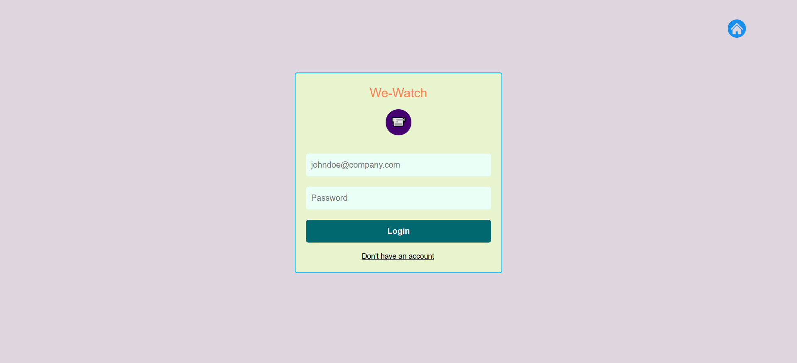

# WeWatch : Optimizing CCTV Storage with Redundant Frame Removal and Object Detection


## Project Overview
Today, the use of CCTV systems is widespread for security and surveillance. However, one significant challenge is the enormous storage space required to store continuous footage, much of which is redundant and unnecessary. Traditional methods often lead to high costs and inefficient storage.
To address this, we developed a solution that removes redundant frames, compresses the videos, and integrates object detection for enhanced surveillance insights.

## Table of Contents
- [Prerequisites](#prerequisites)
- [Installation](#installation)
- [Project Structure](#project-structure)
- [Setup and Configuration](#setup-and-configuration)
- [Running the Application](#running-the-application)
- [Features](#features)
- [Screenshots](#screenshots)
- [Troubleshooting](#troubleshooting)
- [Contributing](#contributing)
- [License](#license)

## Prerequisites

Before you begin, ensure you have the following installed:

- Python 3.8+
- Django
- FFMPEG
- Required Python packages (see `requirements.txt`)

### Hardware Requirements
- Webcam or IP Camera
- Stable internet connection
- Minimum 4GB RAM
- Minimum 10GB storage for recordings
- Recommended: GPU for optimal YOLO model performance

## Installation

### 1. Clone the Repository
```bash
git clone https://github.com/sreenathsnv/CCTV-Storage-optimisation.git
cd CCTV-Storage-optimisation
```

### 2. Create Virtual Environment
```bash
python -m venv venv
source venv/bin/activate  # On Windows, use `venv\Scripts\activate`
```

### 3. Install Dependencies
```bash
pip install -r requirement.txt
```

### 4. Install FFMPEG
- **Windows**: Download from [FFMPEG Official Site](https://ffmpeg.org/download.html)
- **macOS**: `brew install ffmpeg`
- **Linux**: `sudo apt-get install ffmpeg`

## Project Structure

```
security-camera-project/
│
├── base/                  # Django base app
├── CCTVStorageOpt/        # Storage optimization module
├── security_cam-main/     # Main camera monitoring scripts
│   └── security_cam-main/
│       ├── loginpage.py   # Camera monitoring launch script
│       ├── connectui.py   # UI connection script
│       ├── Model.py       # Machine learning model handler
│       ├── yolov5s.pt     # YOLO pre-trained model
│       └── recordings/    # Video recording storage
├── static/                # Static files
├── templates/             # HTML templates
├── manage.py              # Django management script
└── requirements.txt       # Python package dependencies
```

## Setup and Configuration

### Database Migration
```bash
python manage.py makemigrations
python manage.py migrate
```

### Create Superuser
```bash
python manage.py createsuperuser
```

## Running the Application

### 1. Start Django Web Application
```bash
python manage.py runserver
```

### 2. Launch Camera Monitoring
- Login to the web interface 
- Go to the security_cam-main folder
- run loginpage.py
- After authentication, a new window will open
- Click Connect
- After recording, Click Close

### 3. Run Monitoring Script
```bash
cd security_cam-main/security_cam-main
python loginpage.py
```

## Features

### Advanced Video Surveillance
- Real-time video monitoring
- Motion detection algorithms

### Object Detection with YOLO
- Utilizes YOLOv5s pre-trained model
- Supports real-time object identification
- Detects multiple object classes simultaneously
- Key detection capabilities:
  - Person detection
  - Vehicle identification
  - Common object recognition
- Configurable detection sensitivity
- Automatic alert generation for specific object classes
- Low-latency inference with optimized model

### Technical Specifications
- Model: YOLOv5s (Small variant)
- Inference Framework: PyTorch
- Supported Objects: 80 pre-trained classes
- Performance: Optimized for real-time processing

### Additional Security Features
- Automated recording
- Alert system with audio notifications
- User authentication
- Storage optimization
- Configurable recording parameters

## Screenshots

### Web Interface


### User-Home


### Connection


### Camera Monitoring


### File upload


### Video gallery -user 


### admin dashboard


### user list


### user videos


## Troubleshooting

### Common Issues
- **FFMPEG Not Found**: Ensure FFMPEG is installed and added to system PATH
- **Database Errors**: Run migration scripts
- **Camera Not Detected**: Check camera permissions and connections
- **YOLO Model Performance**: 
  - Ensure compatible GPU drivers
  - Check PyTorch installation
  - Verify model file integrity

### Logging
Check `django.log` for detailed error information.

## Contributing

1. Fork the repository
2. Create your feature branch (`git checkout -b feature/AmazingFeature`)
3. Commit your changes (`git commit -m 'Add some AmazingFeature'`)
4. Push to the branch (`git push origin feature/AmazingFeature`)
5. Open a Pull Request

## License

Distributed under the MIT License. See `LICENSE` for more information.

## Contact

Your Name - sreenathsnvaltpb@gmail.com

Project Link: [https://github.com/sreenathsnv/CCTV-Storage-optimisation]